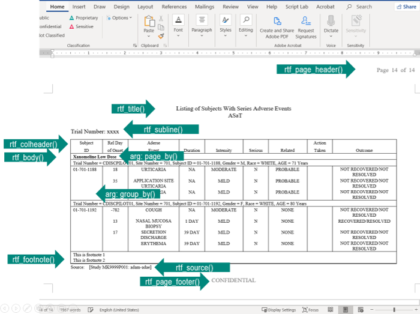
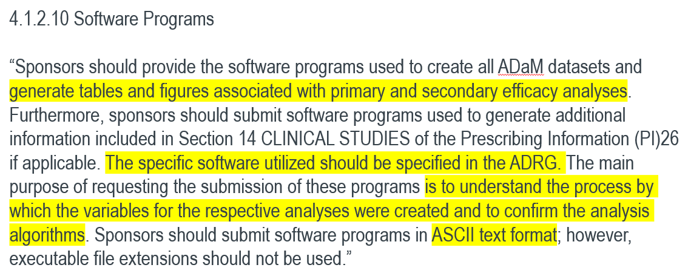

```{r, include = FALSE, eval = FALSE}
# Deployment to RStudio Connect 
system("rm -r output")
dir.create("output/")
file.copy("2021-r2rtf-submission.html", to = "output/")
file.copy("pdf", "output", recursive = TRUE)
rsconnect::deployApp(
  appDir = "./output",                          # the directory containing the content
  appPrimaryDoc = "2021-r2rtf-submission.html", # the primary file
  appName = "2021-r2rtf-submission",            # name of the endpoint (unique to your account on Connect)
  appTitle = "2021-r2rtf-submission",           # display name for the content
  account = "zhanyilo",                         # your Connect username
  appId = "d4e56f72-54e9-40a9-8dda-febabf3b36d3",
  server = "rconnect.merck.com"                 # the Connect server, see rsconnect::accounts()
)
```

```{r setup, include=FALSE}
knitr::opts_chunk$set(echo = TRUE)
library(dplyr)
library(tidyr)
library(r2rtf)
library(ggplot2)
data("r2rtf_adae")
```

## Disclaimer

- All opinions expressed are those of the presenter and not 
  Merck Sharp & Dohme Corp., a subsidiary of Merck & Co., Inc., Kenilworth, NJ, USA.

- Some slides need to be scrolled down to see the full content. 

## Motivation

In the pharmaceutical industry, RTF/Microsoft Word play a central role 
in preparing clinical study reports  

- [ICH E3 Structure and Content of Clinical Study Reports](https://database.ich.org/sites/default/files/E3_Guideline.pdf)

Different organization can have different table standards

- E.g., Table layout, Font size, Border type, Footnote, Data source

`r2rtf` is designed to:

- Generate highly customized tables
- Limit package dependency
- Target regulatory deliverables   
- Support pipes (`%>%`) 

## Minimal Example 

`r2rtf` is designed to enable pipes (`%>%`) 

```{r}
head(iris) %>%
  rtf_body() %>%                     # Step 1 Add table attributes 
  rtf_encode() %>%                   # Step 2 Convert attributes to RTF encode 
  write_rtf("rtf/minimal.rtf")       # Step 3 Write to a .rtf file
```

```{r, out.width = "100%", out.height = "400px", echo = FALSE, fig.align = "center"}
knitr::include_graphics("pdf/minimal.pdf")
```

## Package Overview

`r2rtf` package provides the flexibility to customize table appearance for 

- **Table component**: title, column header, footnote, etc.
- **Table cell style**: size, border type, color, font size, text color, alignment, etc.
- **Flexible control**: the specification of the cell style can be row or column vectorized.
- **Complicated format**: pagination, section grouping, multiple table concatenations, etc.

`r2rtf` package also provides the flexibility to convert figures in RTF format.

## Simple Example - Adverse Events  

`r2rtf` only focuses on **table format**. 
Data manipulation and analysis shall be handled by other R packages. (e.g. `tidyverse`)
  
```{r}
tbl <- r2rtf_adae %>%        # Built-in adverse events dataset in r2rtf package
  count(TRTA, AEDECOD) %>%
  pivot_wider(names_from = TRTA, values_from = n, values_fill = 0)
tbl %>% head(4)
```

Function Arguments:

- `colheader`: character string for column names
- `col_rel_width`: relative width of each column
- `text_justification`: justification of text for each cell/column/table. 
   - e.g., `"c", "l", "r"`

```{r}
tbl %>%   
  rtf_colheader(
    colheader = "Adverse Events | Arm A | Arm B | Arm C", # define column header names
    col_rel_width = c(3, 2, 2, 2)) %>%                    # define relative width for column header
  rtf_body(
    col_rel_width = c(3, 2, 2, 2),                        # define relative width for table body
    text_justification = c("l", "c", "c", "c")) %>%       # define text justification
  rtf_encode() %>%                             
  write_rtf("rtf/simple.rtf") 
```

```{r, out.width = "100%", out.height = "400px", echo = FALSE, fig.align = "center"}
knitr::include_graphics("pdf/simple.pdf")
```

## Function Summary 

`r2rtf` provides simple "verb" functions that correspond to each component of a table, 
  to help you translate data frame to table in RTF file.

```{r, echo = FALSE}
r2rtf_funs <- read.csv("r2rtf-functions.csv")
names(r2rtf_funs)[3] <- "Optional/required"
knitr::kable(r2rtf_funs)
```

## Function Illustration 

```{r, out.width="80%", echo = FALSE}

```

## Figure Example 

- Create a figure (e.g. using `ggplot2`)

```{r, message = FALSE}
pruritus <- r2rtf_adae %>% 
  filter(AEDECOD == "PRURITUS") %>%
  group_by(TRTA, AEDECOD) %>%
  summarise(Count = n_distinct(USUBJID)) 

fig <- ggplot(data = pruritus, aes(x = TRTA, y = Count)) +
  xlab("") +
  geom_bar(stat = "identity")

fig       
```

- save figures into PNG format. (e.g. using `png()` or `ggplot2::ggsave()`).

```{r}
filename <- "fig/fig1.png"
ggsave(filename, fig)
```

- read PNG files into R using `rtf_read_png()`.
- add features using `rtf_title()`, `rtf_footnote()`, `rtf_source()`, etc.
- set up page and figure options using `rtf_figure()`.
- convert to RTF encoding using `rtf_encode(doc_type = "figure")`. 
- write to a .rtf file using `write_rtf()`.

```{r}
filename %>%
  rtf_read_png() %>%
  rtf_title("Pruritus Frequency by Treatment Group") %>%
  rtf_footnote("footnote here") %>%
  rtf_source("[datasource: adam-adae]") %>%
  rtf_figure() %>%                            # setup figure options
  rtf_encode(doc_type = "figure") %>%         # need to specify doc_type = "figure"
  write_rtf("rtf/fig.rtf") 
```

```{r, out.width = "100%", out.height = "400px", echo = FALSE, fig.align = "center"}
knitr::include_graphics("pdf/fig.pdf")
```

## Efficacy Table Example 

```{r}
r2rtf_tbl1
```

```{r}
r2rtf_tbl2
```

```{r}
r2rtf_tbl3
```

```{r, echo = FALSE}
tbl_1 <- r2rtf_tbl1 %>%
  rtf_title(
    title = "ANCOVA of Change from Baseline at Week 20",
    subtitle = c(
      "Missing Data Approach",
      "Analysis Population"
    )
  ) %>%
  rtf_colheader(
    colheader = " | Baseline | Week 20 | Change from Baseline",
    col_rel_width = c(3, 4, 4, 9)
  ) %>%
  rtf_colheader(colheader = "Treatment | N | Mean (SD) | N | Mean (SD) | N | Mean (SD) | LS Mean (95% CI){^a}", 
                col_rel_width = c(3, 1, 3, 1, 3, 1, 3, 5)) %>%
  rtf_body(
    col_rel_width = c(3, 1, 3, 1, 3, 1, 3, 5),
    text_justification = c("l", rep("c", 7)),
    last_row = FALSE) %>%
  rtf_footnote(
    footnote = c("{^a}Based on an ANCOVA model.",
                 "ANCOVA = Analysis of Covariance, CI = Confidence Interval, LS = Least Squares, SD = Standard Deviation")) %>% 
  rtf_source(
    source = "Source: [study999: adam-adeff]"
  )

tbl_2 <- r2rtf_tbl2 %>%
  rtf_colheader(
    colheader = "Pairwise Comparison | Difference in LS Mean (95% CI){^a} | p-Value",
    text_justification = c("l", "c", "c"),
    col_rel_width = c(8, 7, 5)
  ) %>%
  rtf_body(
    col_rel_width = c(8, 7, 5),
    text_justification = c("l", "c", "c"),
    last_row = FALSE
  )

tbl_3 <- r2rtf_tbl3 %>%
  rtf_body(
    as_colheader = FALSE,
    col_rel_width = c(1),
    text_justification = "l"
  )
```

- `tbl_1`, `tbl_2`, `tbl_3` are three table component after adding table attributes (e.g. `rtf_title`) 
using `r2rtf`

```{r}
tbl <- list(tbl_1, tbl_2, tbl_3)
```

```{r}
tbl %>%
  rtf_encode() %>%
  write_rtf("rtf/efficacy.rtf")
```

```{r, out.width = "100%", out.height = "400px", echo = FALSE, fig.align = "center"}
knitr::include_graphics("pdf/efficacy.pdf")
```

## More Examples 

Other extended examples and features are covered in different documents listed in 
[table of content](https://merck.github.io/r2rtf/articles/index.html). 

- [Baseline Characteristics Tables](https://merck.github.io/r2rtf/articles/example-basechar.html)
- [Efficacy Tables](https://merck.github.io/r2rtf/articles/example-efficacy.html)
- [AE Summary Count Tables](https://merck.github.io/r2rtf/articles/example-ae-summary.html)
- [Figures](https://merck.github.io/r2rtf/articles/example-figure.html)

## Regulatory Submission 

- After table, listing and figure are generated and clinical statistical reports are created, 
  Sponsors require to send selected R source code to regulatory agency. 
- FDA guidance on [study data technical conference guide](https://www.fda.gov/media/88173/download)

```{r, out.width = "100%", out.height = "400px", echo = FALSE, fig.align = "center"}

```

## Action Items for Regulatory Submission 

- Create txt files that contain R code for primary and secondary efficacy analysis
  - Our solution: [pkglite](https://merck.github.io/pkglite/index.html), a tool, grammar, and standard to represent and exchange R package source code as text files. 

- Update Analysis Data Reviewer's Guide (ADRG) and Analysis Results Metadata (ARM)
  - Provide R and R package version using 
    [RStudio Package manager](https://packagemanager.rstudio.com) or 
    [MRAN](https://mran.microsoft.com/timemachine) snapshot  
  - Guidance on file structure 
  - Guidance on rerun the analysis
  
- [R Pilot submission to FDA](https://htmlpreview.github.io/?https://github.com/RConsortium/submissions-wg/blob/main/Documents/pilot_submission_proposal.html) (future work)

## Acknowledgement

Team members who involved in testing and contributed table and figure examples

<div style="float: left; width: 50%;">
- Huei-Ling Chen 
- Madhusudhan Ginnaram
- Peikun Wu 
- Ruchitbhai Patel
- Uday Preetham Palukuru
- Jane Liao
- Daniel Woodie
</div>
<div style="float: left; width: 50%;">
- Sarad Nepal
- Christine Teng
- Benjamin Koch
- Nileshkumar Patel
- Benjamin Wang
- Yirong Cao
</div>

# Thank you {.thank-you}

**Email:** yilong.zhang@merck.com
